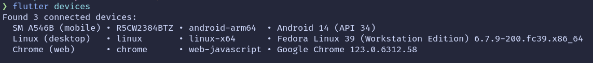

# closely_io


A social network that allows users to talk with nearby people and discover users in the same localization.

## Application Purpose
- Allow users to communicate with each other via text and image;
- Find nearby users and befriend them;
- Use special motions to communicate with other users
- Allow users to communicate with each other via text and image;

## Sensors & mobile functionalities
**Localization**    -> Find nearby devices to chat
**Accelerometer**	-> social interaction by gestures
**Camera**		    -> Take photos to share
**File System**	    -> Keep photos and configs/history
**GPS/Maps**	    -> Show friends on map.

## How to Install

First, make sure you have flutter correctly installed by running
```bash
flutter doctor
```

If everything is ok, enable usb debugging on your device.
**You have to connect and android device** instead of an emulator for this app to work.

After that check if your device is connected by running
```bash
flutte devices
```
It should appear something like this:



After that, take the information about your device and run
```bash
flutter run --release -d <your-device-id>
```

Alternally you can build the app and install it on your device by running

```bash
flutter build <your-device-id>
```

